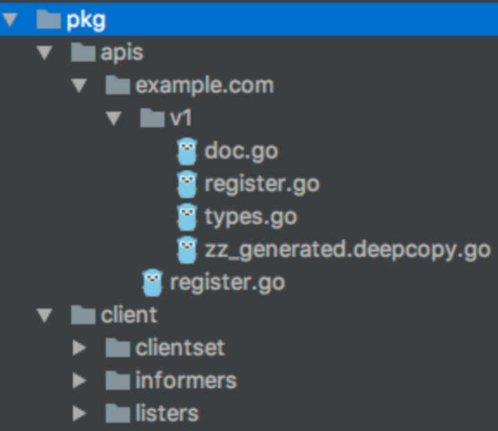

# code-generator
Golang 代码生成器用于实现 Kubernetes 风格的 API 类型。

这篇文章展示了代码生成器是如何工作的，以及如何以最少的代码行将它们应用到您自己的项目中，为您提供生成的 deepcopy 函数、类型化客户端（typed clients）、listers 和 informers，所有这些都只需要一个 shell 脚本调用和几个代码注释。

## 为什么需要 Code Generation ？

## 调用项目中的代码生成器
所有 Kubernetes 代码生成器都基于 [k8s.io/gengo](https://github.com/kubernetes/gengo) 之上实现。它们共享许多常见的命令行标志。基本上，所有的生成器都会得到一个输入包列表（--input-dirs），它们逐个类型地遍历，并输出生成的代码。生成的代码：

- 要么进入与 deepcopy-gen 等输入文件相同的目录（使用 --output-file-base "zz_generated.deepcopy" 来定义文件名）。
- 或者它们生成一个或多个输出包（带有--output-package），如client-、informer-和lister-gen（通常生成到pkg/client）。

上面的描述可能听起来比较复杂，但事实并非如此: [k8s.io/code-generator](https://github.com/kubernetes/code-generator) 提供了一个 shell 脚本 [generator-group.sh](https://github.com/kubernetes/code-generator/blob/master/generate-groups.sh) , 它完成了调用生成器的繁重工作以及他们对 CustomResources 用例的所有特殊小要求。
您在项目中要做的所有事情都归结为一条线，通常在 hack/update-codegen.sh 中：

```shell
$ vendor/k8s.io/code-generator/generate-groups.sh all \

github.com/openshift-evangelist/crd-code-generation/pkg/client \ 

github.com/openshift-evangelist/crd-code-generation/pkg/apis \

example.com:v1
```

它针对一个项目运行之后，生成的项目结构树类似下面：


所有的 API 都应该在 pkg/apis 之下，并且 clientset、informers 和 listers 都是在 pkg/client 中创建的。换句话说，pkg/client 是完全生成的，
就像包含我们的 CustomResource golang 类型的 types.go 文件旁边的 zz_generated.deepcopy.go 文件一样。
两者都不应该手动修改，而是通过运行下面去更新：

```shell
$ hack/update-codegen.sh
```

通常，它旁边还有一个 hack/verify-codegen.sh 脚本，如果任何生成的文件不是最新的，它会以非零返回码终止。
这对于放入 CI 脚本非常有帮助：如果开发人员不小心修改了文件或者文件刚刚过时，CI 会注意到并报异常。

## 控制生成的代码 – Tags
虽然代码生成器的某些行为是通过上述命令行标志控制的（尤其是要处理的包），但更多的属性是通过 golang 文件中的标签控制的。

有两种标签： 
- doc.go 中包上方的全局标签
- 处理类型之上的本地标签

标签通常具有 // +tag-name 或 // +tag-name=value 的形状，也就是说，它们被写入注释。根据标签，评论的位置可能很重要。有许多标签必须位于类型（或全局标签的包行）正上方的注释中，
其他标签必须与类型（包行）分开，中间至少有一个空行。 只需准备好一个空行可能很重要。最好按照示例复制基本形状。

### GLOBAL TAGS
全局标签被写入包的 doc.go 文件中。一个典型的 pkg/apis/<apigroup>/<version>/doc.go 看起来像这样：
```go
// +k8s:deepcopy-gen=package,register
// Package v1 is the v1 version of the API.
 // +groupName=example.com
 package v1
```
它告诉 deepcopy-gen 默认为该包中的每种类型创建 deepcopy 方法。如果您有不需要或不需要 deepcopy 的类型，您可以选择退出带有本地标签的此类类型 // +k8s:deepcopy-gen=false。
如果您未启用包范围的深度复制，则必须通过 // +k8s:deepcopy-gen=true 为每种所需类型选择深度复制。

注意：上例值中的 register 关键字将启用将 deepcopy 方法注册到方案中。这将在 Kubernetes 1.9 中完全消失，因为该方案将不再负责对 runtime.Objects 进行深度复制。
相反，只需调用 yourobject.DeepCopy() 或 yourobject.DeepCopyObject()。您可以而且您现在应该在基于 1.8 的项目中这样做，因为它更快且更不容易出错。此外，您将为需要此模式的 1.9 做好准备。

最后， // +groupName=example.com 定义了完全限定的 API 组名称。如果你弄错了，client-gen 将产生错误的代码。请注意，此标签必须位于包上方的注释块中（请参阅问题 #53893）。

### LOCAL TAGS
本地标签要么直接写在 API 类型之上，要么写在它上面的第二个注释块中。这是我们关于 CustomResources 的 API 服务器深入研究系列的 golang 类型的示例 types.go：
```go
// +genclient

// +genclient:noStatus

// +k8s:deepcopy-gen:interfaces=k8s.io/apimachinery/pkg/runtime.Object
// Database describes a database.
 type Database struct {
 metav1.TypeMeta `json:",inline"`
 metav1.ObjectMeta `json:"metadata,omitempty"`


 Spec DatabaseSpec `json:"spec"`
 }


// DatabaseSpec is the spec for a Foo resource
 type DatabaseSpec struct {
 User string `json:"user"`
 Password string `json:"password"`
 Encoding string `json:"encoding,omitempty"`
 }


// +k8s:deepcopy-gen:interfaces=k8s.io/apimachinery/pkg/runtime.Object


// DatabaseList is a list of Database resources
 type DatabaseList struct {
 metav1.TypeMeta `json:",inline"`
 metav1.ListMeta `json:"metadata"`


 Items []Database `json:"items"`
 }

```

请注意，我们默认为所有类型启用了 deepcopy，也就是说，可以选择退出。但是，这些类型都是 API 类型，需要 deepcopy。因此，我们不必在此示例 types.go 中打开或关闭 deepcopy，而只需在 doc.go 中的包范围内打开或关闭。


## Reference

[Kubernetes Deep Dive: Code Generation for CustomResources](https://cloud.redhat.com/blog/kubernetes-deep-dive-code-generation-customresources)


