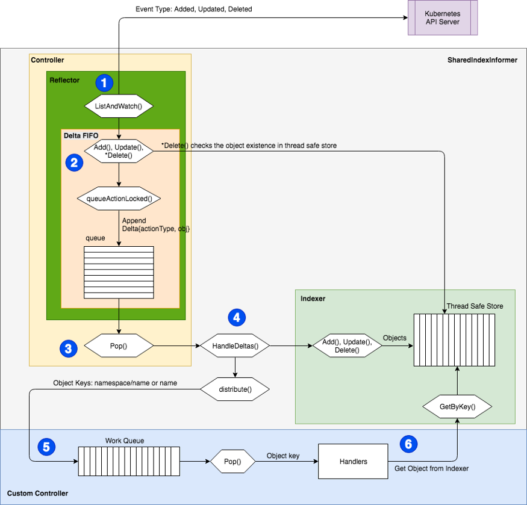

# How to Create a Kubernetes Custom Controller Using client-go

使用 Kubernetes 自定义控制器，您可以通过观察来自 Kubernetes API 对象（例如命名空间、部署或 pod）或您自己的 CRD（自定义资源定义）资源的事件来进一步开发自己的自定义业务逻辑。

本文的下一部分将深入探讨 client-go 模块，然后是一个自定义控制器示例。

## client-go module

client-go 被 Kubernetes 用作官方 API 客户端库，提供对 Kubernetes API 服务器服务的 Kubernetes RESTful API 接口的访问。 kubectl 或 prometheus-operator 等工具大量使用它。

该库包含几个重要的包和实用程序，可用于访问 API 资源或促进自定义控制器。

`kubernetes` 包提供客户端和 Kubernetes 资源特定客户端方法来访问标准 Kubernetes API。请注意，您不应将其用于访问 CRD 资源。这个包是自动生成的。

`discovery` 包提供了发现服务器支持的 API 组、版本和资源的方法。

`dynamic`包提供了一个动态客户端，可以对任意 Kubernetes API 资源执行 RESTful 操作 [1]。请注意，不鼓励使用它来访问 CRD 资源，因为它不是类型安全的 [2]。

`transport`包设置安全的 TCP 授权和连接。如果未明确禁用，默认将使用 HTTP2 协议。底层 HTTP2 工具由 k8s.io/apimachinery/util/net 提供。由于某些操作需要在客户端和容器之间传输二进制流，例如附加、执行、端口转发和日志记录，因此传输包还建立了流通道。在 HTTP2 可用之前，它采用了 SPDY 和 WebSocket 协议。

`plugin`包为 Openstack、GCP 和 Azure 等云提供商提供授权插件。

`scale`包提供了一个多态的 scale 客户端，它能够为任何实现“scale”子资源的资源获取和更新 Scale，只要该子资源在可转换为 autoscaling.Scale 的规模的厌恶上运行。请注意，在 Kubernetes v1.10 之前，它不支持扩展 CRD[2]。

`util`包提供了方便的实用程序，例如工作队列、缓冲区。

`tool/cache`包有很多有用的工具，例如 SharedInformer、reflector、stores 和 indexer。它提供了客户端查询和缓存机制，减少了对服务器的请求数量并持续跟踪事件。我将详细介绍此包中实用程序提供的工作流程，因为它在编写自定义控制器时会进行管道处理。

client-go/tool/cache/ 和自定义控制器流程:

如上图所示，动作有两个主要部分。一个发生在 SharedIndexInformer 中，另一个发生在自定义控制器中。

1. Reflector 对 Kubernetes API 服务器执行对象（例如命名空间、pod 等）ListAndWatch 查询。三种事件类型添加、更新和删除与相关对象一起被记录。然后将它们传递到 DeltaFIFO。请注意，默认情况下只能检索过去五分钟内发生的事件。

> 给定的 Kubernetes 服务器只会在有限的时间内保留更改的历史列表。默认情况下，使用 etcd3 的集群会保留最近 5 分钟内的更改。当请求的监视操作由于该资源的历史版本不可用而失败时，客户端必须通过识别状态码 410 Gone、清除本地缓存、执行列表操作并从该资源返回的 resourceVersion 启动监视来处理这种情况。新的列表操作。大多数客户端库为此逻辑提供某种形式的标准工具。 （在 Go 中，这称为反射器，位于 k8s.io/client-go/cache 包中。）[3]

2. DeltaFIFO 摄取与 watch 事件对应的事件和对象，然后将它们转换为 Delta 对象。这些 Delta 对象被附加到等待处理的队列中。对于已删除，它将检查它是否已存在于线程安全存储中，这样它就可以避免在某些不存在的情况下排队执行删除操作。

3. 缓存控制器（不要与自定义控制器混淆）调用 Pop() 方法使 DeltaFIFO 队列出列。 Delta 对象被传递到 SharedIndexInformer 的 HandleDelta() 方法以进行进一步处理。

4. 根据Delta对象的动作（事件）类型，对象首先通过HandleDeltas方法中的indexer方法保存到线程安全存储中。然后，它通过 SharedIndexInformer 中的 sharedProcessor 的 Distribute() 方法将这些对象发送到已由自定义控制器通过 SharedInformer 的方法（例如 AddEventHandlerWithResyncPeriod() ）注册的事件处理程序。

5. 注册的事件处理程序将对象转换为“namespace/name”格式的键字符串，如果没有命名空间，则通过 MetaNamespaceKeyFunc() 用于添加和更新事件，DeletionHandlingMetaNamespaceKeyFunc() 用于删除事件。然后将键添加到自定义控制器的工作队列中。工作队列的类型可以在 util/workqueue 中找到。

6. 自定义控制器通过调用自定义处理程序从工作队列中弹出键进行处理。自定义处理程序将调用索引器的 GetByKey() 以从线程安全存储中检索对象。自定义处理程序是您的业务逻辑所在。

## 使用工作队列的简单自定义控制器示例

下面是一个在默认命名空间中监视 pod 的自定义控制器示例。工作队列类型是 RateLimitQueue。在下面的示例中，控制器产生了一名工作人员。您可以在调用 controller.Run() 时更改工作人员的数量。

请注意，下面的示例使用 IndexInformer，它只能有一组处理程序来订阅事件。建议改用 SharedIndexInformer。不同之处在于 ShareIndexInformer 提供了 AddEventHandlerWithResyncPeriod() 等方法，允许您添加多组处理程序，因此可以将一个事件请求同时分发给不同的处理程序，从而减少 API 请求的数量。

如果你想连接你的 CRD，你可以按照这个说明为你的 CRD 资源生成客户端、informer 等。然后，您可以在自定义控制器中使用生成的 SharedInformer。

